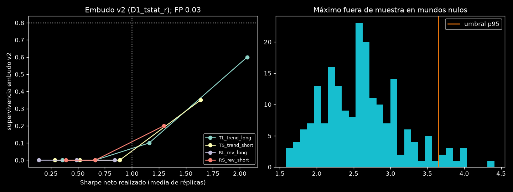
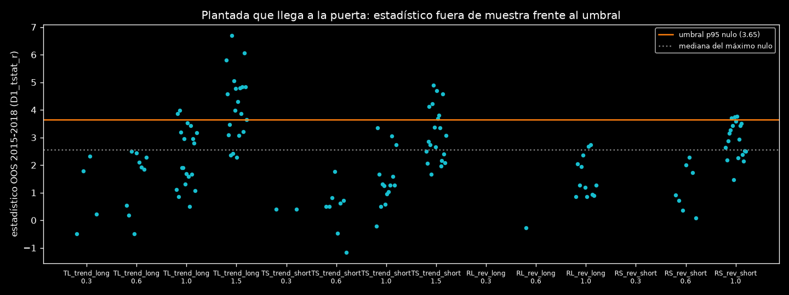
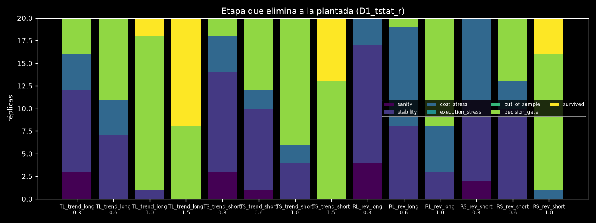

# Fase K — Embudo v2 calibrado por simulación

**Veredicto: BLOQUEADO.** El embudo v2 no es válido con el criterio preregistrado y no se ha aplicado a datos reales.
Los falsos positivos cumplen (3 %, objetivo ≤ 5 %), pero ninguna plantada supera el 80 % de supervivencia con Sharpe realizado ≤ 1,0.

- Ninguna estrategia real se ha evaluado en esta fase.
- `trials/ledger.jsonl` no ha cambiado: md5 `0eef3ea96eb2c809a340545fedeb0b53`, igual antes y después; total 4.489.850.
- Evaluaciones sintéticas de la fase: 57.639.799, en 589 entradas de `trials/synthetic_ledger.jsonl`.

## Procedimiento

- **Preregistro.** `configs/funnel_calibrated.yaml` se registró en `7749aaa`. La enmienda de calibración (run `funnel_v2_k2`) se commiteó en `7d76a69`, antes de ejecutar ningún mundo; ver DECISIONS.
- **Código.** `src/sqxf/control/funnel_v2.py` y `scripts/funnel_v2.py`; tests en `tests/test_funnel_v2.py`.
- **Embudo v2.**
  1. Sanidad en entrenamiento 2004–2014: ≥ 200 trades, R medio > 0 y PF > 1,0.
  2. Estabilidad, costes ×2 y retraso de 1 barra, como en la Fase 2.
  3. Fuera de muestra 2015–2018: ≥ 40 trades.
  4. Puerta por simulación: el umbral es el p95 del máximo OOS de cada mundo nulo, sobre 200 mundos.

  Se probaron 3 estadísticos:
  - D1: t de R, costes ×1;
  - D2: Sharpe diario;
  - D3: t de R, costes ×2.
- **Mundos nulos.** Días completos de EURUSD 2004–2018 barajados sobre un calendario sintético de 15 años: 200 para el umbral (semillas 71000+) y 100 independientes para los falsos positivos (72000+).
  - El genético de la Fase 2 corre completo en cada mundo: 99.000 evaluaciones únicas, con la semilla del mundo.
- **Plantadas.** 4 estrategias de g1:
  - TL y TS: tendencia EMA 20/100 con breakout 20;
  - RL y RS: RSI 14 con banda de Bollinger 20,2.

  El edge es localizado y compensado: +δ pips/H1 en las barras posteriores a la señal nula, restado de forma uniforme en las demás barras.
  - 20 réplicas por estrategia y tamaño (semillas 73000+). El pool es el archivo del genético en el mundo plantado más la plantada.
  - Supervivencia: pasa la plantada, o una estrategia del pool con correlación diaria > 0,8 con ella.

### Calibración (mundo 79999)

| Plantada | Sharpe nulo | δ para 0,3 / 0,6 / 1,0 / 1,5 (pips/H1) | Sharpe obtenido |
|---|---|---|---|
| TL | −0,38 | 0,28 / 0,41 / 0,63 / 1,03 | 0,30 / 0,59 / 0,95 / 1,54 |
| TS | −0,33 | 0,22 / 0,30 / 0,44 / 0,75 | 0,34 / 0,56 / 1,03 / 1,52 |
| RL | −0,70 | 0,69 / 1,00 / 1,38 / **inalcanzable** (máx. 1,31) | 0,29 / 0,65 / 1,03 / — |
| RS | −0,47 | 0,63 / 0,88 / 1,63 / **inalcanzable** (máx. 1,38) | 0,35 / 0,60 / 1,01 / — |

Con compensación, la respuesta de la reversión no es monótona en δ. La deriva compensatoria de las barras inactivas genera señales nuevas que pierden. Por eso la bisección original en [0, 20] divergía, y se enmendó a rejilla + bisección antes de ejecutar mundos.

**Ratio de precio.** La compensación conserva exactamente la ratio final/inicial del mundo nulo: desviación máxima 6·10⁻¹⁴ en las 280 réplicas.
- Ratio en las réplicas: media 0,954, rango [0,832; 1,115].
- En los 300 nulos: media 0,973, rango [0,779; 1,329]. Solo el 62 % cae en 0,85–1,0.
- El rango 0,85–1,0 del objetivo se cumple respecto al nulo, no en términos absolutos: lo determina el barajado de días, no el edge.

## Resultados

### Umbral y falsos positivos

| Diseño | Máx. nulo p50 / p90 / p95 / p99 | Umbral (p95) | FP en 100 nulos independientes |
|---|---|---|---|
| D1_tstat_r | 2,57 / 3,34 / 3,65 / 4,02 | **3,647** | **3 %** |
| D2_sharpe | 1,24 / 1,56 / 1,70 / 1,79 | 1,695 | 4 % |
| D3_tstat_r_x2 | 2,21 / 2,95 / 3,33 / 3,70 | 3,325 | 4 % |

- Los tres diseños cumplen FP ≤ 5 %. La regla preregistrada elige **D1**: los tres empatan a 0 en supervivencia mínima a 1,0, y el empate va a D1.
- En los mundos nulos llegan a la puerta, de media, 9.446 de las 99.000 estrategias.
  - Por etapa: sanidad 36.637 → estabilidad 16.959 → costes 10.223 → retraso 9.446.
  - La puerta compara cada estrategia real contra el máximo de unas 9.400 candidatas.

### Supervivencia de las plantadas (D1)

Las columnas de tamaño son el objetivo de calibración. El Sharpe realizado es la media ± desviación típica sobre las 20 réplicas, en 2004–2018.

| Plantada | Tamaño | Sharpe realizado | R medio | Llega a la puerta | Supervivencia | Qué la elimina (réplicas) |
|---|---|---|---|---|---|---|
| TL | 0,3 | 0,36 ± 0,28 | +0,043 | 20 % | 0 % | estabilidad 9, costes 4, puerta 4, sanidad 3 |
| TL | 0,6 | 0,66 ± 0,27 | +0,081 | 45 % | 0 % | puerta 9, estabilidad 7, costes 4 |
| TL | 1,0 | 1,16 ± 0,27 | +0,142 | 95 % | 10 % | puerta 17, estabilidad 1 |
| TL | 1,5 | 2,07 ± 0,34 | +0,252 | 100 % | **60 %** | puerta 8 |
| TS | 0,3 | 0,29 ± 0,24 | +0,035 | 10 % | 0 % | estabilidad 11, costes 4, sanidad 3, puerta 2 |
| TS | 0,6 | 0,52 ± 0,25 | +0,063 | 40 % | 0 % | estabilidad 9, puerta 8, costes 2, sanidad 1 |
| TS | 1,0 | 0,89 ± 0,25 | +0,108 | 70 % | 0 % | puerta 14, estabilidad 4, costes 2 |
| TS | 1,5 | 1,64 ± 0,27 | +0,198 | 100 % | 35 % | puerta 13 |
| RL | 0,3 | 0,14 ± 0,14 | +0,014 | 0 % | 0 % | estabilidad 13, sanidad 4, costes 3 |
| RL | 0,6 | 0,49 ± 0,18 | +0,050 | 5 % | 0 % | costes 11, estabilidad 8, puerta 1 |
| RL | 1,0 | 0,84 ± 0,15 | +0,085 | 60 % | 0 % | puerta 12, costes 5, estabilidad 3 |
| RS | 0,3 | 0,39 ± 0,21 | +0,041 | 0 % | 0 % | estabilidad 9, costes 9, sanidad 2 |
| RS | 0,6 | 0,66 ± 0,20 | +0,069 | 35 % | 0 % | estabilidad 10, puerta 7, costes 3 |
| RS | 1,0 | 1,30 ± 0,16 | +0,132 | 95 % | 20 % | puerta 15, costes 1 |

Con D2, la mejor supervivencia es TL 1,5 al 65 % y RS 1,0 al 35 %. Con D3, todas son iguales o peores. Ninguna combinación de ningún diseño llega al 80 %.

- **Edge mínimo con supervivencia ≥ 80 %:** no existe en el rango probado, que llega hasta un Sharpe realizado medio de 2,07.
- **Supervivencia por equivalente:** de 25 supervivencias, solo 1 fue por una estrategia equivalente (correlación > 0,8).
  - La correlación máxima entre las 50 mejores candidatas OOS y la plantada tiene mediana 0,51, p90 0,68 y máximo 0,89.
  - El genético contiene el hash exacto de la plantada en el 0–40 % de las réplicas, según la estrategia.

### Comparación informativa con el embudo de la Fase 2

- **Nulos 0–29:** 0 % de mundos con algún superviviente tras el DSR.
- **Plantadas, réplicas 0–2:** 0 % de supervivencia en las 14 combinaciones, incluida TL 1,5 (Sharpe ≈ 2).

El v2 mejora la potencia frente a la Fase 2: de 0 % a 60 % en edges de Sharpe ~2, con FP ≤ 5 %. No alcanza el criterio de validez.

## Diagnóstico

1. **El límite es la longitud del OOS frente al máximo de miles de candidatas.**
   - Una estrategia con Sharpe anual ≈ 1 tiene un t esperado en 4 años de ≈ 2. Mediana del t de la plantada en D1: TL 1,0 → 1,9; RS 1,0 → 2,9.
   - El máximo nulo entre ~9.400 supervivientes tiene mediana 2,57 y p95 3,65.
   - Con 4 años de validación, superar el p95 del máximo con un 80 % de probabilidad exige un Sharpe realizado de ≈ 2 o más.
   - Con D1, TL 1,5 (Sharpe 2,07) solo llega al 60 %.
2. **En edges pequeños (≤ 0,6), las etapas en muestra los eliminan antes de la puerta.**
   - Estabilidad (los tres bloques positivos) y costes ×2 matan del 55 % al 100 % de las réplicas.
   - Con Sharpe 0,3–0,6 en 11 años, un bloque de 3–4 años negativo es frecuente.
3. **La reversión compensada no supera un Sharpe de ~1,3–1,4** en este mundo de calibración. El tamaño 1,5 de RL y RS es inalcanzable; no afecta a la validez, que exige Sharpe ≤ 1,0.
4. **El genético no reconstruye la plantada:** correlación máxima mediana 0,51. La única vía de supervivencia es la propia plantada insertada en el pool.

Para un edge de Sharpe ≈ 1, en el mejor caso real el genético no lo encuentra; en el mejor caso sintético está en el pool y la puerta lo mata. Un nulo del embudo v2 sobre datos reales no habría descartado edges de Sharpe ≤ 1,3.

## Limitaciones

- g1 no tiene predicados de sesión u hora: no se plantó ninguna estrategia de sesión.
- Calibración en un único mundo (79999). El Sharpe realizado en las réplicas se desvía del objetivo (TL 1,5 → 2,07) porque cada réplica es otro mundo; se reporta el realizado.
- La ratio final/inicial de los mundos nulos (0,78–1,33) la determina el barajado; la compensación solo garantiza que la plantada no la cambie.
- El FP se mide en 100 mundos: el intervalo binomial al 95 % para 3/100 es ≈ 0,6–8,5 %.
- Elegir entre 3 diseños sobre las mismas réplicas tiene un sesgo optimista. Es irrelevante aquí porque ninguno es válido.
- Edge plantado en un único par sintético (EURUSD) y con la geometría de salida de g1.

## Qué no se hizo (por preregistro)

- **Sin pasada real:** ni EURUSD ni réplica en los otros 5 pares, ni DSR real, ni control aleatorio.
- No se relajó ningún criterio ni se repitió ninguna semilla.

BLOQUEADO: el embudo v2 tiene FP 3 % pero supervivencia máxima 20 % con Sharpe realizado ≤ 1,0 (y 60 % a Sharpe ≈ 2); un OOS de 4 años no separa edges de Sharpe ~1 del máximo de ~9.400 candidatas nulas.
