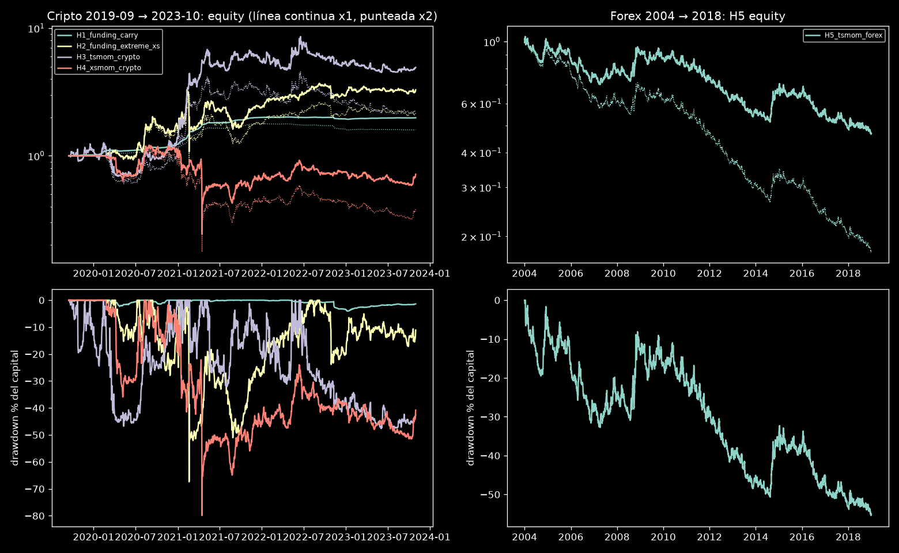
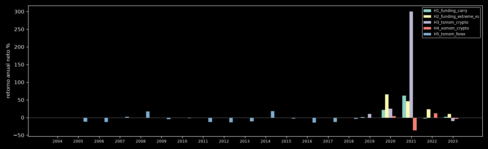
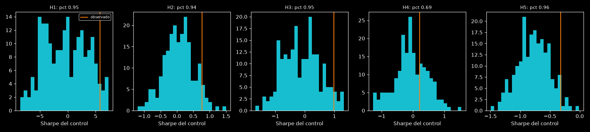

# Fase C2 — Primas estructurales con 5 hipótesis preregistradas

**Resultado:**
- Pasa 1 de 5: H1, el carry de funding (largo spot y corto perpetuo). Las otras cuatro no pasan.
- H1 es evidencia limitada y dependiente del régimen: el 99 % del resultado viene de 2020–2021 y el último tercio de la muestra es ligeramente negativo.
- H1 superó el umbral de "demasiado bueno" (Sharpe 5,75 > 3, PF diario 4,37 > 2). Se investigó antes de reportarlo y no aparece fuga, coste ausente ni error de unidades; la explicación está abajo.

**Procedencia:**
- Preregistro: `configs/premia_c2.yaml` (`0ef06d5`), commiteado antes de calcular nada.
- Código: `src/sqxf/premia/` y `scripts/premia_c2.py` (`71aaed3`). Pasada única: `runs/premia_c2_r1/`, semilla 20261004.

**Ensayos:**
- 5 hipótesis (Bonferroni: p unilateral ≤ 0,01), más 5 estreses ×2 y 1.000 réplicas de control. Todo queda anotado en `trials/ledger.jsonl`, con un total de 4.490.860.
- Los ensayos efectivos de la fase son los 5 preregistrados: no hubo búsqueda.

**Datos:**
- Cripto: 2019-09-16 → 2023-10-31 (4,13 años), `until=development` de C1. El bloque de selección y el holdout no se han cargado.
- Forex: 2004 → 2018 (15 años), con el cargador que filtra al leer.
- Hay 0 días sin barra en cripto y 1–3 en forex.

## Potencia (fijada en el preregistro, antes de los resultados)

SE(Sharpe) ≈ 1/√años, α unilateral 0,01.

| Muestra | Años | SE | Sharpe mín. detectable (50 % / 80 %) | Potencia a Sharpe 0,5 | Potencia a 1,0 |
|---|---|---|---|---|---|
| Cripto (H1–H4) | 4,13 | 0,49 | 1,15 / 1,56 | 10 % | 38 % |
| Forex (H5) | 15,0 | 0,26 | 0,60 / 0,82 | 35 % | 94 % |

- **Cripto:** el diseño no puede detectar un Sharpe de 0,5 y detecta uno de 1,0 con menos del 40 % de probabilidad. Un nulo en H2–H4 no descarta primas de Sharpe ~0,5–1.
- **Forex:** el diseño sí detecta un Sharpe de 1,0.

## Resultados por hipótesis

Retornos diarios netos de costes y funding/swap; drawdown en % del capital, con capital compuesto.

| Hipótesis | Sharpe (IC 95 %) | t | p unilateral | CAGR | Vol | Max DD | PF diario | ×2: Sharpe / CAGR / DD | Tercios + | Pasa |
|---|---|---|---|---|---|---|---|---|---|---|
| H1 carry de funding | **5,75** (3,81–7,93) | 3,97 | **0,0004** | 18,1 % | 2,9 % | −4,1 % | 4,37 | 3,48 / 12,0 % / −10,8 % | 2 de 3 | **sí** |
| H2 funding extremo (XS) | 0,76 (0,17–2,05) | 2,35 | 0,014 | 33,4 % | 64,5 % | −67,4 % | 1,24 | 0,61 / 20,9 % / −68,9 % | 3 de 3 | no (p) |
| H3 tendencia temporal cripto | 0,98 (0,01–1,99) | 1,91 | 0,032 | 47,2 % | 55,3 % | −47,6 % | 1,18 | 0,64 / 22,2 % / −53,7 % | 2 de 3 | no (p) |
| H4 momentum XS cripto | 0,21 (−0,55–1,12) | 0,61 | 0,26 | −7,8 % | 61,8 % | −79,9 % | 1,05 | −0,02 / −20,5 % / −84,3 % | 1 de 3 | no |
| H5 tendencia forex | −0,32 (−0,80–0,16) | −1,34 | 0,91 | −4,9 % | 13,0 % | −55,4 % | 0,94 | −0,82 / −10,9 % / −83,1 % | 0 de 3 | no |

**Tercios** (media diaria en pb y Sharpe por subperiodo):

| | Tercio 1 | Tercio 2 | Tercio 3 |
|---|---|---|---|
| Fechas cripto | 2019-09-16 → 2021-01-30 | 2021-01-31 → 2022-06-16 | 2022-06-17 → 2023-10-31 |
| H1 | +5,82 / 8,36 | +7,99 / 7,59 | −0,12 / −0,27 |
| H2 | +16,1 / 1,46 | +21,5 / 0,77 | +2,7 / 0,40 |
| H3 | +18,3 / 1,08 | +34,9 / 1,95 | −8,7 / −0,96 |
| H4 | −1,2 / −0,10 | +15,4 / 0,59 | −3,7 / −0,56 |
| H5 (2004–08 / 09–13 / 14–18) | −0,3 / −0,06 | −3,3 / −0,72 | −1,2 / −0,23 |

**Exposición y descomposición** (sumas de los retornos diarios en la ventana):

| | Bruta media | Posiciones por rebalanceo | Rotación/año | Precio | Carry (funding/swap) | Coste |
|---|---|---|---|---|---|---|
| H1 | 2,06 (máx. 5,35) | 12,6 patas | 8,2 | −0,006 | +0,730 | −0,037 |
| H2 | 0,90 | 3,1 | 44,7 | +1,777 | +0,399 | −0,153 |
| H3 | 0,69 | 6,3 | 54,3 | +2,879 | −0,463 | −0,183 |
| H4 | 0,90 | 3,1 | 45,8 | +0,658 | +0,030 | −0,156 |
| H5 | 1,95 | 6,0 | 99,2 | +0,343 | −0,835 | −0,138 |

### Por año (retorno neto %, Sharpe, max DD %)

| Año | H1 | H2 | H3 | H4 |
|---|---|---|---|---|
| 2019 (desde 16-09) | +1,3 / 4,04 / −0,4 | 0 (sin posiciones) | +10,4 / 0,91 / −19,5 | 0 (sin posiciones) |
| 2020 | +21,6 / 8,14 / −2,3 | +65,6 / 1,47 / −27,9 | +25,0 / 0,68 / −46,8 | +4,3 / 0,31 / −35,9 |
| 2021 | +62,3 / 10,77 / −0,5 | +45,9 / 0,89 / −67,4 | +300,0 / 2,42 / −32,1 | −36,1 / 0,24 / −78,3 |
| 2022 | −2,8 / −1,56 / −3,5 | +23,1 / 0,89 / −23,8 | −0,8 / 0,27 / −41,4 | +11,9 / 0,54 / −24,4 |
| 2023 (hasta 31-10) | +2,2 / 3,53 / −0,6 | +10,5 / 0,72 / −12,7 | −9,9 / −0,35 / −20,3 | −4,0 / −0,09 / −21,6 |

En 2019 y hasta principios de 2020, H2 y H4 están planas: necesitan al menos 3 monedas elegibles, y BNB entra el 2020-02-18.

| Año | H5 forex |
|---|---|
| 2004–2008 | −1,4 / −11,5 / −12,6 / +2,0 / +17,1 |
| 2009–2013 | −4,5 / −2,6 / −12,5 / −13,4 / −11,2 |
| 2014–2018 | +18,0 / −2,7 / −14,1 / −13,0 / −4,0 |

## Control aleatorio emparejado (diagnóstico, 200 réplicas)

El control mantiene la trayectoria de |peso| y el número de posiciones, y asigna una dirección aleatoria a cada tramo de posición.

| | Sharpe medio del control | p95 del control | Percentil del observado | p del control |
|---|---|---|---|---|
| H1 | −0,39 | 5,49 | 0,95 | 0,050 |
| H2 | 0,06 | 0,79 | 0,94 | 0,070 |
| H3 | −0,12 | 0,89 | 0,95 | 0,055 |
| H4 | −0,06 | 0,73 | 0,69 | 0,313 |
| H5 | −0,78 | −0,35 | 0,96 | 0,040 |

- **H5:** la dirección de la tendencia es mejor que el azar (percentil 0,96), pero los costes y el swap conservador se comen el resultado. Con la misma exposición, el control pierde de media un Sharpe de −0,78.
- **H1:** el control invierte el carry moneda a moneda. Su distribución es ancha (8 monedas con signos al azar), y el p95 de 5,49 refleja las réplicas que caen mayoritariamente del lado del carry.

## H1: por qué el Sharpe es tan alto (investigación de "demasiado bueno")

1. **No hay señal, así que no puede haber fuga:** las posiciones solo dependen de la elegibilidad (perpetuo existente, 120 días de historia, liquidez causal).
2. **Unidades.** Un oráculo independiente con pesos fijos diarios da:
   - funding del 12,9 %/año, base de −0,75 %/año y desviación diaria de 0,17 %;
   - Sharpe de 3,74 antes de costes.

   El motor da un carry del 17,7 %/año. La diferencia es la deriva: entre rebalanceos mensuales se mantiene la cantidad, y en las subidas de 2021 el nocional cubierto crece y cobra más funding.
   - La exposición bruta llega a 5,35x el 2021-02-19.
3. **Costes incluidos:** comisiones de las dos patas (spot 0,10 %, perpetuo 0,05 %) más deslizamiento por tramo, en total 0,9 %/año.
4. **Funding real de Binance:**
   - media de BTC por 8 h: 2020 0,016 %, 2021 0,028 %, 2022 0,004 %;
   - BNB publica tasa 0 en el 45 % de sus eventos;
   - SOL tiene días con funding horario (noviembre de 2022).
5. **El Sharpe alto viene de la volatilidad casi nula de la cobertura.** Spot y perpetuo de Binance cierran casi al mismo precio a las 00:00 UTC, así que la volatilidad anual es del 2,9 %.
   - El peor día es 2022-11-10 (FTX), con −5,3 % por la base de SOL.
   - El resultado está concentrado en el régimen: +21,6 % en 2020 y +62,3 % en 2021, frente a −2,8 % en 2022 y +2,2 % en 2023. El último tercio tiene Sharpe −0,27.

**Lo que el backtest no modela y que reduciría el resultado:**
- liquidación o ajustes de margen de la pata corta cuando el nocional se dispara (bruta de 5,35x);
- el haircut del colateral spot;
- el riesgo de contraparte del exchange;
- la comisión spot real según el nivel VIP;
- monedas que desaparecieron (LUNA, FTT), cuyo carry pudo acabar en pérdida total de la base.

Con una restricción estricta de bruta ≤ 1x (0,5 spot y 0,5 perpetuo), el retorno se divide por dos y el Sharpe no cambia.

**Lectura:** H1 cumple los tres criterios preregistrados:
- p = 0,0004;
- 2 de 3 tercios positivos;
- con ×2 sigue positivo, con Sharpe 3,48.

Pero es una prima conocida, medida en 4 años, cuyo rendimiento depende del régimen alcista de 2020–21 y desapareció en el último tercio (2022-06 → 2023-10). Es evidencia de que la prima existió en ese periodo, no de que persista.

## Series efectivas (PCA, ratio de participación)

| Conjunto | Series | Efectivas |
|---|---|---|
| Monedas cripto (perpetuos elegibles) | 8 | 2,14 |
| Pares forex | 6 | 3,00 |
| Hipótesis H1–H4 (mismas fechas) | 4 | 3,81 |

Correlaciones entre hipótesis cripto: H1–H2 0,22, H1–H3 0,17, H1–H4 0,07, H2–H3 −0,08, H2–H4 0,10, H3–H4 0,02. H5 no se solapa en fechas con las de cripto.

**Paso final (informativo):** solo pasa una hipótesis, así que no hay correlación entre hipótesis aprobadas ni cartera naive que construir.

## Limitaciones

- **Supervivencia:** las 8 monedas son supervivientes elegidas en 2026. El universo de cada fecha se aproxima con la fecha de listado del perpetuo y la liquidez, pero faltan los perpetuos deslistados o colapsados (LUNA, FTT, …). Esto sesga al alza H1 y H3 y de forma incierta H2 y H4.
- **Sin liquidaciones ni límites intrasemana:**
  - Entre rebalanceos la exposición deriva con los precios: H4 llegó a perder un 63 % en un día (corto en DOGE, +101 % el 2021-04-16).
  - La bruta ≤ 1x se cumple en cada rebalanceo, no entre rebalanceos.
- **Cripto con potencia baja** (4,13 años): H2 (Sharpe 0,76, p 0,014) y H3 (0,98, p 0,032) no son nulos claros. Son compatibles con primas de Sharpe ~0,5–1 que este diseño no puede confirmar.
- **H5:** el swap conservador (1 pip/noche para ambos lados, sin carry a favor) cuesta ~5,6 %/año con una bruta de ~2x. Sin swap, el componente de precio es +0,34 en 15 años (≈ +2,3 %/año) frente a −0,14 de costes. El swap real sin verificar es la mayor incertidumbre de H5.
- **H5:** el PnL de USDJPY, USDCHF y USDCAD se toma como fracción del nocional, sin conversión de divisa.
- **Funding:** el evento de 2023-11-01 00:00 queda fuera (pertenece al bloque de selección). H1 empieza plana hasta el 2019-09-30, porque el perpetuo de BTC es elegible desde el 16-09 y el primer rebalanceo del 15-09 aún no lo admite.
- **Comisión spot del 0,10 % y vol a 60 días:** son supuestos preregistrados que no están verificados con el exchange.

C2 COMPLETA
